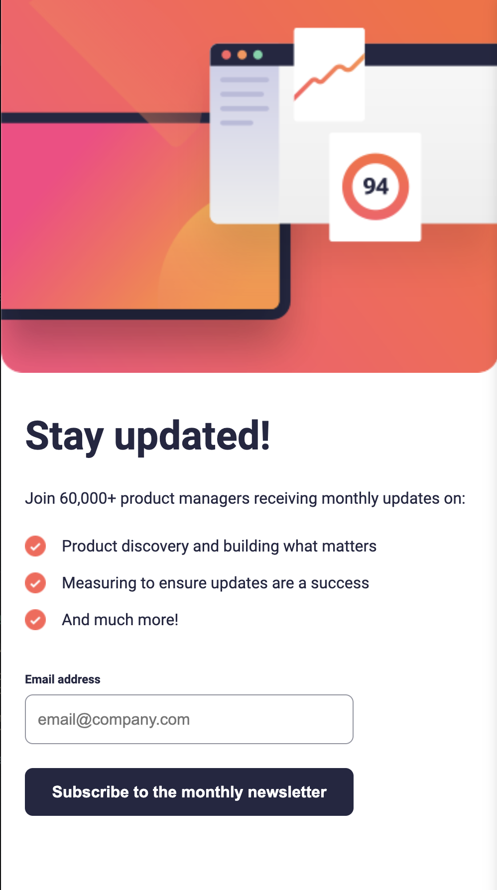

# Frontend Mentor - Newsletter sign-up form with success message solution

This is a solution to the [Newsletter sign-up form with success message challenge on Frontend Mentor](https://www.frontendmentor.io/challenges/newsletter-signup-form-with-success-message-3FC1AZbNrv). Frontend Mentor challenges help you improve your coding skills by building realistic projects. 

## Table of contents

- [Frontend Mentor - Newsletter sign-up form with success message solution](#frontend-mentor---newsletter-sign-up-form-with-success-message-solution)
  - [Table of contents](#table-of-contents)
  - [Overview](#overview)
    - [The challenge](#the-challenge)
    - [Screenshot](#screenshot)
    - [Links](#links)
  - [My process](#my-process)
    - [Built with](#built-with)
    - [What I learned and Useful resources](#what-i-learned-and-useful-resources)
    - [Continued development](#continued-development)
  - [Author](#author)

## Overview

### The challenge

Users should be able to:

- Add their email and submit the form
- See a success message with their email after successfully submitting the form
- See form validation messages if:
  - The field is left empty
  - The email address is not formatted correctly
- View the optimal layout for the interface depending on their device's screen size
- See hover and focus states for all interactive elements on the page

### Screenshot

 
 

### Links

- Solution URL: [Solution URL here](https://www.frontendmentor.io/solutions/reactpowered-responsive-newsletter-form-chOYm5GhMo)
- Live Site URL: [Live site URL here](https://newsletter-form-app.netlify.app/)

## My process

### Built with

- Semantic HTML5 markup
- CSS custom properties
- Flexbox
- CSS Grid
- Mobile-first workflow
- [React](https://reactjs.org/) - JS library

### What I learned and Useful resources

In the process of completing this project, I gained experience in using React and specifically worked with the `useState` hook.

- [React - State and Lifecycle](https://reactjs.org/docs/state-and-lifecycle.html)
- [React - Hooks at a Glance](https://reactjs.org/docs/hooks-overview.html)
- [React - Hooks API Reference](https://reactjs.org/docs/hooks-reference.html)
- [React Hooks Cheat Sheet](https://react-hooks-cheatsheet.com/)

### Continued development

I plan to:
- Enhance skills in managing different states with React
- Explore more about React hooks
- Understand the lifecycle of components
- Ensure smooth user experience across different devices

## Author

- LinkedIn - [Doina Leovchin](https://www.linkedin.com/in/doinaleovchindeveloper/)
- Frontend Mentor - [@yDoileo](https://www.frontendmentor.io/profile/Doileo)
